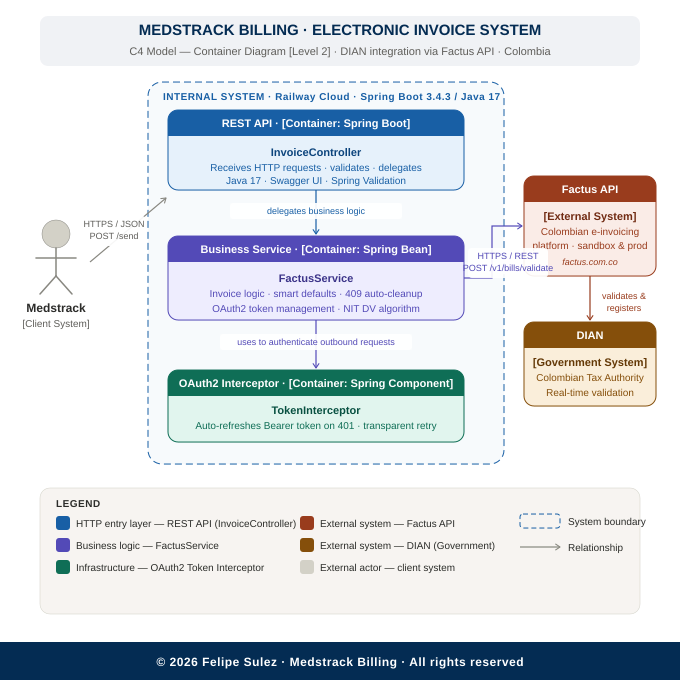
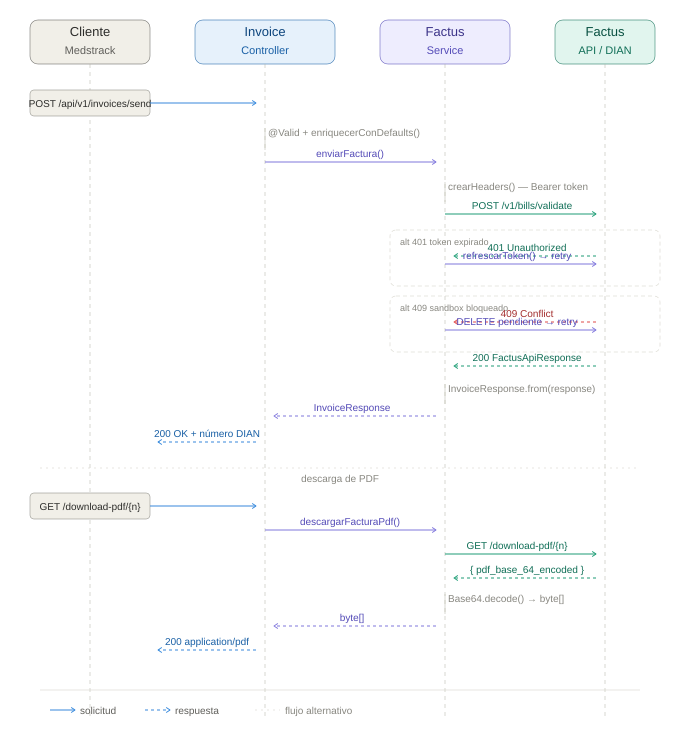

# Medstrack Billing

Production REST API for electronic invoice issuance, validation, and management in compliance with Colombian tax authority (DIAN) regulations via the Factus platform.

> **Live API** — https://medstrack-factus-production.up.railway.app/swagger-ui/index.html
> **Health** — https://medstrack-factus-production.up.railway.app/actuator/health

---

## Overview

Colombian tax law requires every business transaction to be reported to DIAN in real time. This service abstracts the full invoice lifecycle — OAuth2 authentication, DIAN validation, retry logic, sandbox conflict resolution, and PDF retrieval — behind a clean REST interface that any internal system can consume with a minimal JSON payload.

Built as the billing backbone for the **Medstrack** healthcare platform.

---

## System Design

### C4 Container Diagram



### Request Sequence — End to End



---

## Architecture

```
┌─────────────────────────────────────────────────────────┐
│  Railway Cloud · Spring Boot 3.4.3 · Java 17            │
│                                                         │
│  InvoiceController  ──▶  FactusService  ──▶  Factus API ──▶ DIAN
│       │                       │                         │
│  (REST entry)         (business logic          (external)
│  (validation)          token · retry                    │
│  (Swagger UI)          defaults · DV)                   │
│                                                         │
│                    TokenInterceptor                     │
│                  (OAuth2 auto-refresh)                  │
└─────────────────────────────────────────────────────────┘
```

**Key design decisions:**

- **No database.** All state lives in Factus. The service is stateless and horizontally scalable.
- **Token self-healing.** A `ClientHttpRequestInterceptor` intercepts every 401, refreshes the Bearer token, and replays the original request — transparent to the caller.
- **409 auto-cleanup.** Factus sandbox blocks a numbering range when a pending invoice exists. The service detects the conflict, deletes the pending invoice via `DELETE /v1/bills/destroy/reference/{ref}`, and retries automatically.
- **Smart defaults.** `enriquecerConDefaults()` fills VAT (19%), payment method, operation type, document type, and municipality — callers only send what they know.
- **DV algorithm.** `NitUtils.calcularDV()` implements the official DIAN weighted-sum algorithm for NIT verification digit calculation.

---

## API Reference

Base URL: `https://medstrack-factus-production.up.railway.app/api/v1/invoices`

| Method | Endpoint | Description |
|---|---|---|
| `POST` | `/send` | Issue and validate an electronic invoice against DIAN |
| `GET` | `/` | List invoices — filterable by reference, NIT, number, status, page |
| `GET` | `/download-pdf/{number}` | Stream PDF binary by DIAN invoice number |
| `GET` | `/debug/token` | Inspect active OAuth2 token *(dev profile only)* |

Full interactive reference with request/response schemas → [Swagger UI](https://medstrack-factus-production.up.railway.app/swagger-ui/index.html)

### Minimal invoice request

```json
POST /api/v1/invoices/send
Content-Type: application/json

{
  "reference_code": "MEDS-2026-001",
  "customer": {
    "identification": "901234567",
    "company": "Medstrack SAS",
    "names": "Felipe Sulez",
    "address": "Calle 93 # 29-10, Bogota",
    "email": "billing@medstrack.com.co"
  },
  "items": [
    {
      "code_reference": "SRV-001",
      "name": "Platform consulting",
      "quantity": "1.00",
      "price": "500000.00"
    }
  ]
}
```

All optional fields (`numbering_range_id`, `payment_form`, `payment_method`, `operation_type`, `dv`, `municipality_id`) are resolved automatically by the service.

### Response

```json
{
  "number": "SETP990026624",
  "reference_code": "MEDS-2026-001",
  "status": "validated",
  "customer": "Medstrack SAS",
  "total": "595000.00",
  "cufe": "abc123...",
  "pdf_url": "/api/v1/invoices/download-pdf/SETP990026624"
}
```

### Error shape

```json
{
  "status": 400,
  "message": "Validation failed: input data does not meet requirements",
  "errors": {
    "customer.identification": "NIT is required",
    "items": "Invoice must have at least one item"
  },
  "path": "/api/v1/invoices/send",
  "timestamp": "2026-03-25T00:10:00"
}
```

---

## Stack

| | |
|---|---|
| Language | Java 17 |
| Framework | Spring Boot 3.4.3 |
| HTTP client | RestTemplate + OAuth2 interceptor |
| Validation | Spring Validation (`@Valid`) |
| API docs | Springdoc OpenAPI · Swagger UI 2.8.5 |
| Monitoring | Spring Actuator |
| Build | Maven |
| Deploy | Railway · Nixpacks |

---

## Project Structure

```
src/main/java/.../reto_facturacion/
├── controller/
│   └── InvoiceController.java        REST endpoints · OpenAPI annotations
├── service/
│   └── FactusService.java            Business logic · token management · retry · 409 cleanup
├── config/
│   ├── FactusProperties.java         Type-safe config (@ConfigurationProperties)
│   ├── RestTemplateConfig.java       HTTP client · configurable timeouts
│   └── TokenInterceptor.java         OAuth2 Bearer auto-refresh on 401
├── dto/
│   ├── InvoiceRequest.java           Input payload · @Valid constraints
│   ├── InvoiceResponse.java          Response mapped from Factus
│   ├── CustomerDTO.java              Invoice recipient
│   ├── ItemDTO.java                  Line items
│   └── factus/                       Internal Factus response DTOs
├── exception/
│   ├── GlobalExceptionHandler.java   Centralized error handling · 4xx · 5xx · @Valid
│   └── ErrorResponse.java            Uniform error response shape
└── util/
    └── NitUtils.java                 DIAN NIT verification digit algorithm
```

---

## Configuration

All credentials are injected via environment variables. Nothing is hardcoded or committed.

> Add `src/main/resources/application-dev.yaml` to `.gitignore`.

### Required

| Variable | Description |
|---|---|
| `FACTUS_API_URL` | Factus API base URL |
| `FACTUS_CLIENT_ID` | OAuth2 client ID |
| `FACTUS_CLIENT_SECRET` | OAuth2 client secret |
| `FACTUS_USERNAME` | Factus account username |
| `FACTUS_PASSWORD` | Factus account password |

### Optional

| Variable | Description | Default |
|---|---|---|
| `FACTUS_RANGE_ID` | DIAN numbering range ID | `8` |
| `FACTUS_MUN_ID` | Default municipality ID | `980` |
| `FACTUS_CONNECT_TIMEOUT` | Connection timeout (ms) | `5000` |
| `FACTUS_READ_TIMEOUT` | Read timeout (ms) | `15000` |

---

## Local Setup

```bash
git clone https://github.com/felipesulez/Medstrack-factus.git
cd Medstrack-factus
mvn clean package -DskipTests

export FACTUS_API_URL=https://api-sandbox.factus.com.co
export FACTUS_CLIENT_ID=<your_client_id>
export FACTUS_CLIENT_SECRET=<your_client_secret>
export FACTUS_USERNAME=<your_username>
export FACTUS_PASSWORD=<your_password>

java -Dspring.profiles.active=dev -jar target/*.jar
```

On `dev` startup, `FactusRunner` issues a smoke-test invoice to verify the sandbox connection.

Swagger UI → http://localhost:8080/swagger-ui/index.html

---

## Deployment

Deployed on Railway via Nixpacks. `railway.toml` is already configured:

```toml
[build]
builder = "NIXPACKS"

[deploy]
startCommand = "java -Dspring.profiles.active=prod -jar target/*.jar"
healthcheckPath = "/actuator/health"
healthcheckTimeout = 30
restartPolicyType = "ON_FAILURE"
restartPolicyMaxRetries = 3
```

---

## Security

- Credentials managed exclusively via environment variables
- `application-dev.yaml` in `.gitignore` — never committed
- `/debug/token` restricted to `dev` profile via `@Profile("dev")`
- Actuator exposes only `/health` and `/info` in production
- No secrets hardcoded anywhere in the codebase

---

## Tests

```bash
mvn test
```

`NitUtilsTest` covers the DIAN verification digit algorithm with boundary and edge cases.

---

## License & Copyright

```
Copyright (c) 2026 Felipe Sulez. All rights reserved.

This project and its source code are the intellectual property of Felipe Sulez.
Unauthorized copying, distribution, modification, or commercial use of this
software, in whole or in part, without the express written permission of the
author is strictly prohibited.
```

For licensing inquiries, open an [issue](https://github.com/felipesulez/Medstrack-factus/issues) or contact via GitHub.

---

© 2026 Felipe Sulez · Medstrack Billing